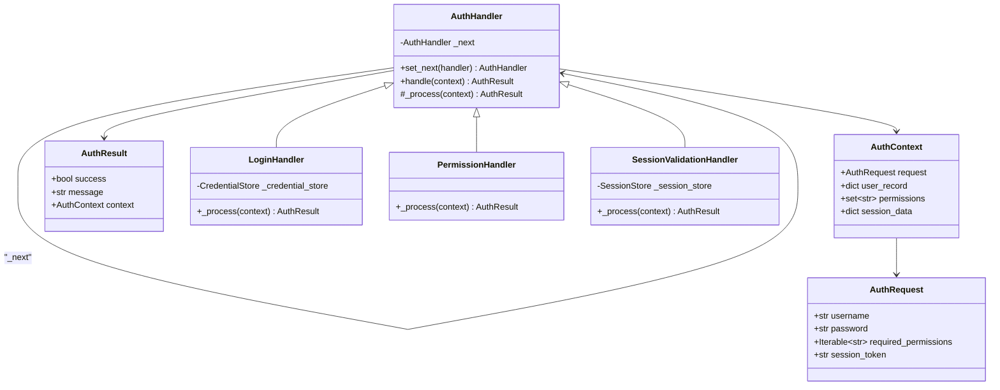

# Diagrama de Classes — Cadeia de Responsabilidade para Autenticação

```mermaid
classDiagram
    class AuthRequest {
        +str username
        +str password
        +Iterable~str~ required_permissions
        +str session_token
    }

    class AuthContext {
        +AuthRequest request
        +dict user_record
        +set~str~ permissions
        +dict session_data
    }

    class AuthResult {
        +bool success
        +str message
        +AuthContext context
    }

    class AuthHandler {
        -AuthHandler _next
        +set_next(handler) AuthHandler
        +handle(context) AuthResult
        #_process(context) AuthResult
    }

    class LoginHandler {
        -CredentialStore _credential_store
        +_process(context) AuthResult
    }

    class PermissionHandler {
        +_process(context) AuthResult
    }

    class SessionValidationHandler {
        -SessionStore _session_store
        +_process(context) AuthResult
    }

    AuthHandler <|-- LoginHandler
    AuthHandler <|-- PermissionHandler
    AuthHandler <|-- SessionValidationHandler

    AuthHandler --> AuthHandler : "_next"
    AuthHandler --> AuthResult
    AuthHandler --> AuthContext
    AuthContext --> AuthRequest
```
